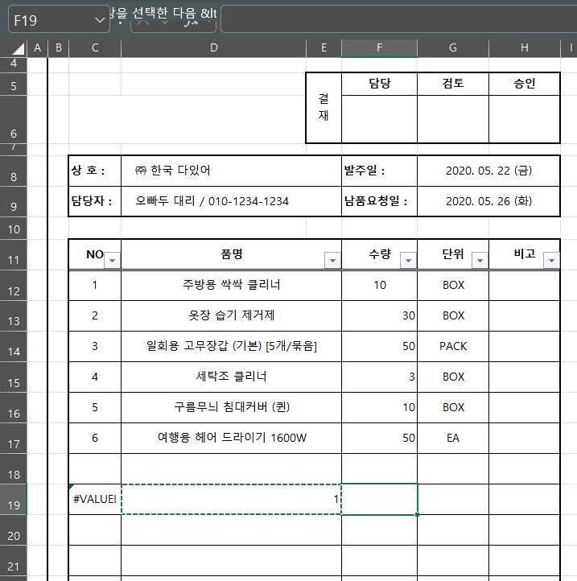
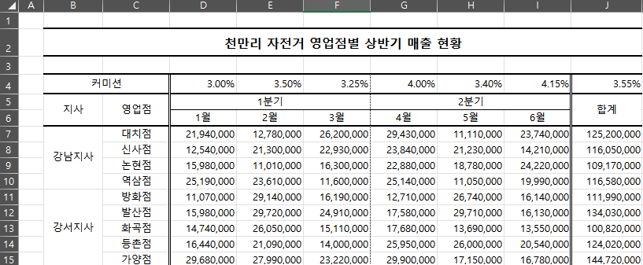
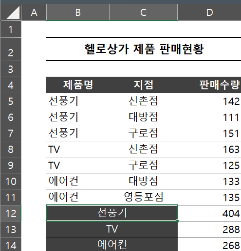

# Excel 1주차 정규 과제 

📌Excel 정규과제는 매주 정해진 분량의 『*진짜 쓰는 실무 엑셀*』 을 읽고 학습하는 것입니다. 이번주는 아래의 **EXCEL_1st_TIL**에 나열된 분량을 읽고 공부하시면 됩니다.

아래의 문제를 풀어보며 학습 내용을 점검하세요. 문제를 해결하는 과정에서 개념을 스스로 정리하고, 필요한 경우 제시된 강의를 참고하여 보완하는 것이 좋습니다.

**교재 실습 예제 파일은 1주차 과제 설명 노션에 있습니다. 해당 파일을 다운 후 실습 진행해주시면 됩니다.**

**👀(수행 인증샷은 필수입니다.)** 

## EXCEL_1st_TIL

### 1장 시작부터 남다른 실무자의 엑셀 활용
#### 01. 엑셀 기본 설정 변경으로 맞춤 환경 만들기 (범위 제외)
#### 02. 엑셀 좀 사용하려면 반드시 알아야 할 엑셀 기본키 (범위 제외)
#### 03. 엑셀의 기본 동작 원리 이해하기
#### 04. 엑셀에서 발생하는 모든 오류와 해결 방법 총정리
#### 05. 실무자면 꼭 알아야 할, 필수 단축키 모음

### 2장 실무자라면 반드시 알아야 할 엑셀 활용
#### 01. 보기 좋은 표, 활용할 수 있는 데이터를 위한 필수 상식
#### 02. 편리한 엑셀 문서 작업을 위한 실력 다지기
#### 03. 엑셀로 시작하는 기초 데이터 분석
#### 02. 엑셀 데이터 가공을 위한 텍스트 나누고 합치기

## Study Schedule

| 주차  | 공부 범위     | 완료 여부 |
| ----- | ------------- | --------- |
| 1주차 | p.22~111    | ✅         |
| 2주차 | p.112~157   | 🍽️         |
| 3주차 | p.158~213  | 🍽️         |
| 4주차 | p.214~273 | 🍽️         |
| 5주차 | p.274~339 | 🍽️         |
| 6주차 | p.340~425 | 🍽️         |
| 7주차 | p.426~472 | 🍽️         |

 

<!-- 여기까진 그대로 둬 주세요-->

---

# 1️⃣ 학습 내용 정리

## 01-3. 엑셀의 기본 동작 원리 이해하기
> **셀 참조 방식에 대해 정리해주세요.**
<!-- 셀 참조 방식에 대해 정리해주세요. -->
- $ 기호를 사용하여 행과 열을 모두 고정하거나 둘 중 하나를 고정할 수 있다
- 상대참조, 절대참조, 혼합참조로 나뉜다
- 상대 참조: $가 포함되지 않음
- 절대 참조: 열과 행에 모두 $가 붙음
- 혼합 참조: 열과 행 중 하나에 $가 붙음

## 01-4. 엑셀에서 발생하는 모든 오류와 해결 방법 총정리
> **숫자처럼 보이는 문자를 빠르게 확인하고 해결하기(51 ~52p)를 진행 후 인증사진을 첨부해주세요.**

## 01-5. 실무자면 꼭 알아야 할, 필수 단축키 모음
> **이번에 배운 단축키에 대해 정리해주세요.**
- ctrl은 동시, alt은 차례대로
- 쉬프트 + F11: 새 시트
- Ctrl + N: 새 통합 문서
- 팝업 메뉴(마우스 우클릭 메뉴 표시) Shift + F10
- 리본 메뉴 숨기기 Ctrl + F1 
- 수식 입력줄 확장 Ctrl + Shift + U 
- 선택된 범위에 값을 한 번에 입력 Ctrl + Enter 
- 표의 끝까지 한 번에 선택 Ctrl + Shift + 방향키 
- 현재 활성화된 셀 확인 Ctrl + Backspace 
- 행/열 전체 선택 Ctrl + Space, Shift + Space

## 02-1. 보기 좋은 표, 활용할 수 있는 데이터를 위한 필수 상식
> **데이터와 표를 비교해주세요**
- 데이터를 정렬하거나 특정 값을 찾아야 할 때
- 새로운 데이터가 누적될 때
- 새로운 구분자를 추가할 때
=> 데이터 아니면 불편을 겪는다

> **셀 병합 기능을 자제해야 하는 이유를 정리해주세요.**
- 병합시 첫 번째 셀의 값만 인식
- 범위 선택이 제한됩니다.
- 범위의 수정/편집이 제한됩니다.
- 표 기능과 피벗 테이블 사용이 제한됩니다.
- 자동 채우기를 제대로 활용할 수 없습니다.
- 데이터 정렬 기능을 사용할 수 없습니다.
- 함수를 사용할 때 옳지 않은 결과를 반환할 수 있습니다

## 02-2. 편리한 엑셀 문서 작업을 위한 실력 다지기
> **셀 병합하지 않고 가운데 정렬하(75 ~77p)를 진행 후 인증사진을 첨부해주세요.**

> **셀 병합 해제 후 빈칸 쉽게 체우기(78 ~79p)를 진행 후 인증사진을 첨부해주세요.**

> **빈 셀을 한 번에 찾고 내용 입력하기(80 ~81p)를 진행 후 인증사진을 첨부해주세요.**
<!-- 이 부분을 지우고 인증사진을 제출해주세요.-->

> **숫자 데이터의 기본 단위를 한 번에 바꾸는 방법(84 ~87p)를 진행 후 인증사진을 첨부해주세요.**
<!-- 이 부분을 지우고 인증사진을 제출해주세요.-->

## 02-3. 엑셀로 시작하는 기초 데이터 분석
> **행/열 전환하여 새로운 관점으로 데이터 살펴보기(88 ~90p)를 진행 후 인증사진을 첨부해주세요.**
<!-- 이 부분을 지우고 인증사진을 제출해주세요.-->

> **중복된 데이터 입력 제한하기(90 ~92p)를 진행 후 인증사진을 첨부해주세요.**
<!-- 이 부분을 지우고 인증사진을 제출해주세요.-->

## 02-4. 엑셀 데이터 가공을 위한 텍스트 나누고 합치기
> **여러 줄을 한 줄로 합치거나 한 줄을 여러 줄로 분리하기(104 ~107p)를 진행 후 인증사진을 첨부해주세요.**
<!-- 이 부분을 지우고 인증사진을 제출해주세요.-->

> **여러 열에 입력된 내용을 간단하게 한 열로 합치기(108 ~109p)를 진행 후 인증사진을 첨부해주세요.**
<!-- 이 부분을 지우고 인증사진을 제출해주세요.-->

---

### 🎉 수고하셨습니다.

